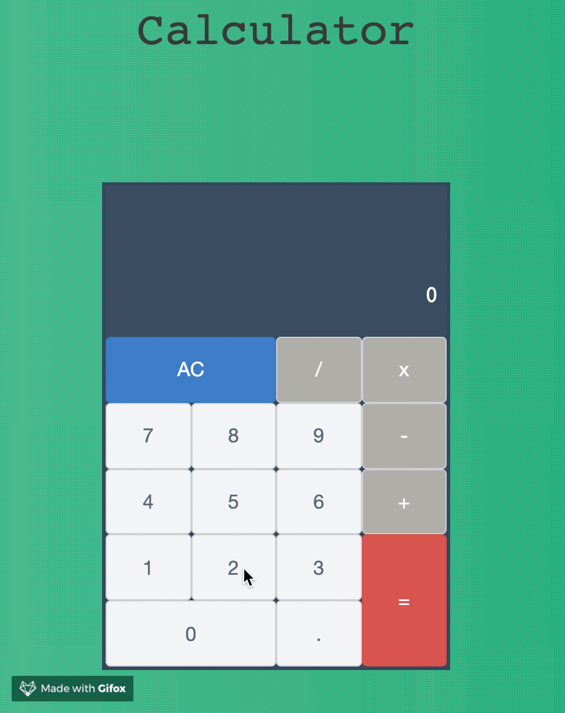

# Wildcard
A basic calculator implemented in Javascript.

## User Interaction
The program takes a string with an arithmetic expression as an argument, evaluates it and returns the result when the user clicks on the equal button.

If the expression string is not a valid arithmetic expression the formula is not updated and the user can  either:

- reset the formula by clicking on the _All Clear_ button,
- click on any other button to enter a valid expression.

## Supported operators

The program uses the same operator precedence and associativity as the javascript programming language and also supports the power operator.

| Operator      |  Description   |
| :-----------: |:--------------:|
|       +       |    Addition    |
|       -       |   Subtraction  |
|       *       | Multiplication |
|       /       |    Division    |
|       **      | Raise to power |

## How to run and install the program

1. Clone the GitHub repo.
2. Open the file _index.html_ in your web browser (recommended browser: Google Chrome)
